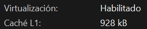
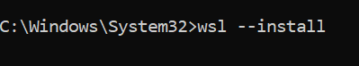
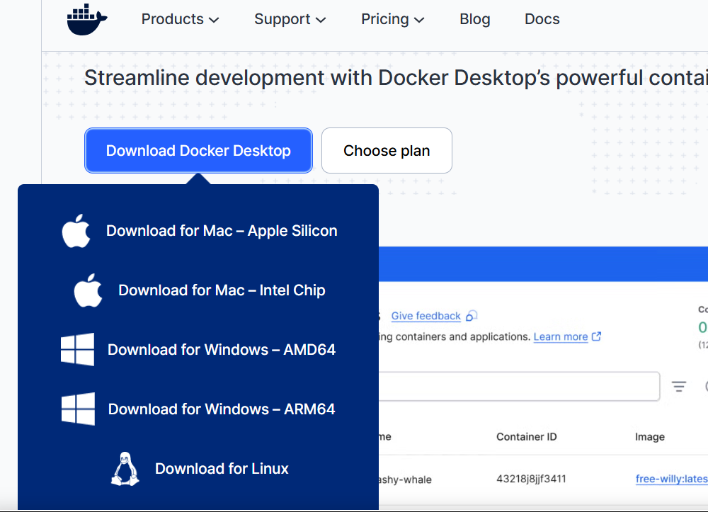
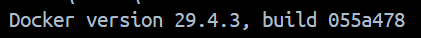

# Instalación de Docker en Windows

## Paso 1: Verificar los requisitos del sistema

Antes de empezar, asegúrate de que tu computadora cumpla con lo siguiente:

- **Sistema Operativo:** Windows 10 (versión 21H2 o superior) o Windows 11 (Home, Pro, Enterprise o Education).
- **Procesador:** Procesador de 64 bits con traducción de direcciones de segundo nivel (SLAT).
- **RAM:** Mínimo 4 GB de memoria RAM.
- **BIOS:** La **virtualización de hardware** debe estar habilitada en la BIOS de tu computadora. (Puedes verificarlo abriendo el *Administrador de tareas* → pestaña *Rendimiento* → sección *CPU*. Ahí deberías ver "Virtualización: Habilitada").



---

## Paso 2: Habilitar WSL 2 (Windows Subsystem for Linux)

Docker Desktop en Windows funciona mejor si utiliza el motor de WSL 2. Para instalarlo o actualizarlo:

1. Abre la **Terminal de Windows** o el **Símbolo del sistema (CMD)** como **Administrador** (clic derecho → Ejecutar como administrador).

2. Escribe el siguiente comando y presiona Enter:

```bash
wsl --install
```

3. **Reinicia tu computadora** para que se apliquen los cambios del sistema.

> 💡 **Nota:** Si ya tenías WSL instalado, es buena idea asegurarte de que esté actualizado ejecutando `wsl --update` en la terminal.



---

## Paso 3: Descargar e instalar Docker Desktop

1. Ve al sitio web oficial de Docker: [docker.com/products/docker-desktop](https://www.docker.com/products/docker-desktop/).
2. Haz clic en el botón **"Download for Windows"** para bajar el instalador (un archivo llamado `Docker Desktop Installer.exe`).
3. Una vez descargado, haz doble clic en el instalador para ejecutarlo.
4. En la pantalla de configuración, asegúrate de que la opción **"Use WSL 2 instead of Hyper-V"** (Usar WSL 2 en lugar de Hyper-V) esté **marcada**.
5. Haz clic en **Ok** y espera a que termine el proceso de instalación.
6. Al finalizar, es muy probable que el instalador te pida cerrar sesión en Windows o **reiniciar la computadora** una vez más. Hazlo.



---

## Paso 4: Configuración inicial y aceptación de términos

1. Al reiniciar, abre la aplicación **Docker Desktop** (búscala en el menú de inicio de Windows).
2. Te aparecerá una ventana con el **Acuerdo de Servicio de Suscripción de Docker**. Léelo y haz clic en **Accept** (Aceptar).
3. A continuación, puedes elegir una configuración rápida (puedes darle "Skip" o saltar si no quieres iniciar sesión con una cuenta de Docker por ahora).
4. Espera un par de minutos a que la ballena de Docker en la esquina inferior izquierda de la aplicación cambie a color **verde** (esto indica que el motor de Docker está corriendo).


---

## Paso 5: Verificar que la instalación fue exitosa

Para asegurarte de que todo quedó bien configurado, abre una nueva ventana de la **Terminal de Windows**, **PowerShell** o **CMD** y ejecuta los siguientes comandos:

**Verificar la versión de Docker:**

```bash
docker --version
```

*(Debería devolverte el número de versión de Docker instalado).*

**Correr un contenedor de prueba:**

```bash
docker run hello-world
```

*(Este comando descargará una imagen ligera de prueba y la ejecutará. Si ves un mensaje de bienvenida que dice **"Hello from Docker!"**, ¡felicidades! Tu Docker está perfectamente instalado y operativo).*


